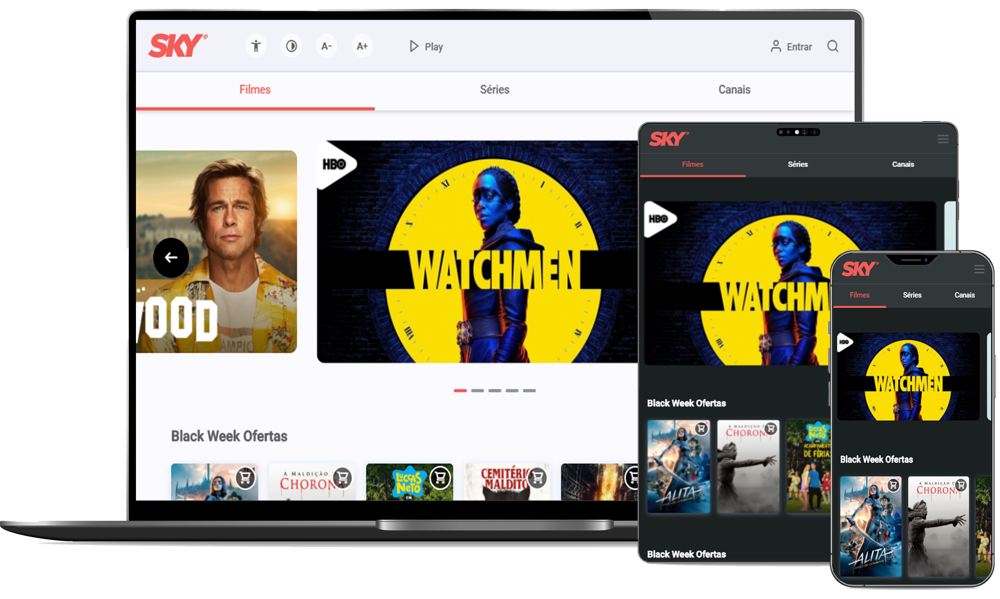

<h1 align="center">
  SKY Homepage Test: <a href="https://amarcoscastelo.github.io/test-sky/" target="_blank">Live a demo</a>
</h1>

  <a href="#-technologies-used">Technologies used</a>&nbsp;&nbsp;&nbsp;|&nbsp;&nbsp;&nbsp;
  <a href="#-project">Project</a>&nbsp;&nbsp;&nbsp;|&nbsp;&nbsp;&nbsp;
  <a href="#-how-to-use-locally">How to use locally</a>&nbsp;&nbsp;&nbsp;|&nbsp;&nbsp;&nbsp;
  <a href="#memo-license">License</a>

 

  

## Technologies used

This project was developed with the following technologies:

- [HTML5](https://developer.mozilla.org/pt-BR/docs/Web/HTML/HTML5)
- [SASS](https://sass-lang.com/)
- [JavaScript](https://developer.mozilla.org/pt-BR/docs/Aprender/JavaScript)
- [JQuery](https://jquery.com/)
- [GulpJs](https://gulpjs.com/)
- [NPM](https://www.npmjs.com/)
- [ESLint](https://eslint.org/)
- [Prettier](https://prettier.io/)

## 💻 Project

This project was developed for the SKY Front End Developer test.

## 🤔 How to use locally

- Clone this repository: `$ git clone https://github.com/AMarcosCastelo/test-sky.git`
- Access the folder: `$ cd test-sky`;
- Install dependecies: `$ yarn` or `$ npm install`;
- Open on `localhost:3000` and start development: `$ yarn dev:watch` or `$ npm run dev:watch`

## :memo: License

This project is under the MIT license. See the file [LICENSE](LICENSE.md) for more details.

---
